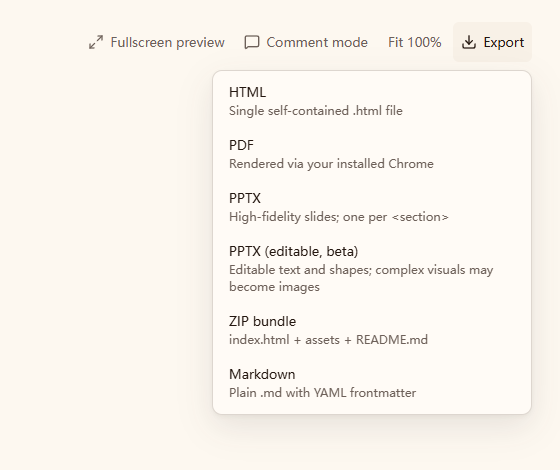

# Exporters

## Editable PPTX (beta, phase one)

The desktop export menu keeps **PPTX** as the existing screenshot-based, appearance-first option. **PPTX (editable, beta)** uses `renderMode: 'native'`: Chromium executes the HTML/JSX, the exporter reads the rendered layout into an in-memory slide model, and PptxGenJS writes native text boxes, basic shapes, and independent image objects. Heavy export dependencies remain lazy-loaded. No new runtime dependencies or browser downloads are introduced.

The library's legacy `renderMode: 'editable'` still extracts headings/bullets from source into a fixed template. It is not the new layout-aware mode and is not exposed in the desktop menu.



Actual toolbar and menu rendered with synthetic preview state; no user design content is shown.

### Authoring contract

Use fixed-size HTML slide containers, preferably 1280 × 720 pixels:

```jsx
function App() {
  const metrics = ['Revenue grew 32%', '120 new customers'];
  return (
    <section data-pptx-slide style={{ width: 1280, height: 720, padding: 48, background: '#fff' }}>
      <h1 style={{ fontSize: 48, lineHeight: 1.2 }}>Quarterly business review</h1>
      <div style={{ display: 'grid', gridTemplateColumns: '1fr 1fr', gap: 24 }}>
        {metrics.map(value => (
          <div key={value} style={{ padding: 24, background: '#e2e8f0', borderRadius: 12 }}>
            <p style={{ fontSize: 24, lineHeight: 1.4, margin: 0 }}>{value}</p>
          </div>
        ))}
      </div>
    </section>
  );
}
```

- Supported page markers: `data-pptx-slide`, `data-slide`, `data-slide-container`, `data-slide-id`, and `.slide`. Nested containers do not create additional pages. A library caller may supply `slideSelector`; an explicit selector with no matches is an error.
- Without slide markers, a unique visible poster artboard is considered before generic `section` elements: use `data-pptx-poster`, or a `poster` / `*-poster` / `*_poster` class with an explicit CSS `aspect-ratio` and portrait dimensions. That single poster gets a source-proportioned PPT page without the surrounding preview stage. Multiple candidates are not guessed; explicit slide markers/custom selectors retain priority.
- Without slide markers, a unique poster, or sections, the exporter fits the complete rendered root/body into one widescreen page and returns a warning. It does not automatically paginate a long webpage. Add slide markers when separate pages are intended.
- Non-active pages are shown one at a time; ordinary `.slide.active` / `display:none` decks are supported. Pages absent from the DOM (conditional rendering or virtualized navigation) cannot be discovered: render every page for export.
- Preview-only ancestor scaling and positioning effects are normalized before measuring a slide. Geometry and typography use its design coordinates, not the size of a scaled preview thumbnail. Design transforms inside the slide are not treated as preview scaling.
- Use `data-pptx-ignore` on navigation/controls to exclude them from editable export.
- Use `data-pptx-raster` to explicitly flatten an unsupported component. Its descendants are not also emitted as text.
- Use explicit slide dimensions. Ordinary slides retain the existing widescreen fit with whitespace for other aspect ratios, never stretching. The single-poster path above instead preserves the source page aspect ratio.
- Browser-computed grid/flex positions are supported for layout; PowerPoint receives fixed geometry, not responsive CSS rules.
- Text is measured into visual lines, including inline emphasis, explicit line breaks, and letter spacing. Each line becomes a separate editable text box without automatic wrapping or shrinking. Editing a multiline paragraph therefore means editing separate line objects; PowerPoint does not retain the original paragraph's browser reflow behavior.
- Ordinary PNG/JPEG data assets are preserved as independent source images. Local images are resolved by the existing workspace asset pipeline. Other image formats/crops may be captured as separate PNG objects.
- Font names are resolved from the actual platform fonts used by Chromium, rather than only the first requested CSS family. Fonts are not embedded. Install the intended fonts on the destination machine; fallback glyphs, CJK, and Office/Chromium text metrics can still differ.

### Supported scope and fallback

Native objects include measured text lines with basic inline runs (font face/size, weight, italic, underline, color, and letter spacing), solid rectangles, rounded rectangles, circles, solid line-like rectangles, uniform solid borders, common simple generated bullet shapes, and independent images. Source pixel positions and font sizes are scaled consistently to PPT inches/points. Rounded-rectangle radii are limited to half the shorter side; other shape types do not receive rectangle-radius adjustments.

Decorative backgrounds, gradients, shadows, nonuniform borders, and generated pseudo-elements are handled separately from ordinary text where possible. Local decoration captures isolate their own pixels so sibling objects and editable foreground text are not baked into the same image. Simple generated decorations can remain native shapes. The outer slide shadow is omitted with a warning because it lies outside the slide canvas.

Subtree rasterization is reserved for explicit image fallback or content that cannot safely be represented by the supported native objects, such as SVG/canvas, tables/charts, unsupported compositing/transforms, and clipping that requires preserving the rendered pixels. Rasterized subtrees are emitted once, not again as descendant text. Images with CSS backgrounds, padding, or cropping may also be captured independently. Conversion warnings identify affected regions and lost editability rather than treating every decorated card or mixed-text block as a whole-slide screenshot.

Warnings are returned in `ExportResult.warnings` and shown by the desktop independently of research-source warnings. Invalid dimensions or per-object numeric/color data, unresolved image fallbacks, broken images, and runtime errors fail descriptively instead of silently dropping objects. XML-forbidden characters in text/font names are replaced with a warning; ordinary text and XML-special punctuation retain their literal contents.

This remains a beta, not a guarantee that arbitrary HTML/CSS will reproduce flawlessly in Office. Source clipping and font metrics can still cause small differences. Native tables, editable chart datasets, paragraph-level reflow across measured line objects, and PowerPoint-to-source round trips are not part of phase one. Prefer the existing image-first export when appearance matters more than editing or the design relies heavily on unsupported effects.

### Verification and dependency repair

```sh
corepack pnpm@10.33.4 --filter @open-codesign/exporters test
corepack pnpm@10.33.4 --filter @open-codesign/exporters typecheck
```

Model regressions parse generated PPTX XML and relationship parts with a dev-only XML parser, check internal relationship targets and ContentTypes declarations, and verify literal text/font-name round trips. A persistent pnpm patch for PptxGenJS 4.0.1 repairs font-attribute escaping and nonexistent per-slide master declarations in both its CJS and ESM entry points. The patch is applied through the package configuration and lockfile, not an untracked edit to installed dependencies; maintenance instructions are in [the patch README](../../patches/README.md).

Native browser tests use an existing system Chrome/Chromium/Edge and skip when none is installed; they never download a browser. Coverage includes JSX props/maps, CJK, grids, hidden slides, preview scaling, local assets, measured mixed-font text, explicit line breaks, isolated decoration pixels, clipping/stacking edge cases, document fallback, and error handling.

### Beta acceptance matrix

This is an opt-in, phase-one Beta, not a cross-platform compatibility certification. Keep image-first PPTX as the appearance-first fallback.

| Environment / layer | Evidence | Boundary |
| --- | --- | --- |
| System Chromium on Windows | Real rendered-DOM regressions: JSX, CJK, cards, hidden pages, preview scales, rich-text lines, clipping, stacking, isolated pixels, and posters | Runs against the installed browser; no bundled browser. Browser suites skip if none is available, so a skipped run is not a browser acceptance pass. |
| Generated Open XML | Parsed XML/rels, valid internal targets and ContentTypes, literal text/font escaping, bounded geometry, single-poster page sizing | Structural regression checks, not complete Open XML XSD certification. |
| Installed Windows PowerPoint | A private six-slide deck and one portrait poster opened, rendered, saved as copies, and reopened; 171 / 55 objects and all text retained | Sample-specific checks, not all designs, fonts, Office releases, or editing operations. Private source and output files are excluded from the repository. |
| macOS PowerPoint, other Windows Office releases, WPS | Not verified for this native Beta | Must be checked before claiming support or identical layout. |
| Linux Chromium / upstream CI | Test suites can use a discovered system browser | Local Windows results do not imply Linux/browser CI acceptance; inspect actual CI results and skips. |

Public synthetic coverage lives in the [main browser suite](src/pptx-native.browser.test.ts), [layering/text edge suite](src/pptx-repair-edge.browser.test.ts), [poster suite](src/pptx-poster.browser.test.ts), [Beta fallback suite](src/pptx-beta.browser.test.ts), and [model/XML suite](src/pptx-model.test.ts). The fallback cases exercise SVG/table regions, compositing/clipping, unavailable fonts, and ignored controls without including user business material.

Before promoting the Beta on another environment:

1. Record the OS, browser and Office/WPS version, installed fonts, and whether browser tests actually ran.
2. Compare browser references with Office-rendered pages, including text baselines, clipping, foreground/background order, portrait boundaries, and fallback regions.
3. In a copy, select and edit ordinary text, move a basic shape, and verify background images do not obstruct the expected foreground objects. Text remains separate measured-line objects, not a reflowing browser paragraph.
4. Save, close, and reopen the copy. Check for repair prompts, object loss and changed text; test at least a text/card deck, an SVG/table page, a scaled/hidden-page deck, and a portrait poster.
5. Confirm image-first and legacy text-only exports still work. Keep the Beta label and document any unverified environment or fidelity limitation rather than silently widening the support claim.
